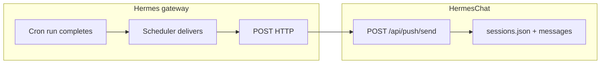

# Hermes cron → HermesChat

**Scope:** Route **Hermes** cron output into the **HermesChat** PWA: a **cron thread** in the sidebar, optional **push**, deep link `/chat/cron-<slug>`. This repo’s Next app implements that at **`app/api/push/send/route.ts`** (appends assistant lines; keys sessions by **`jobId`** / **`job_id`** in the webhook JSON).

**Job store:** `HERMES_HOME/cron/jobs.json` (Docker: often `/opt/data/cron/jobs.json`). Use the **`cronjob`** tool or **`hermes cron`** CLI.

## Flow



## `deliver` (required shape)

Hermes parses **`deliver`** by splitting on the **first** `:`.

| Wrong | Right |
|-------|--------|
| `http://127.0.0.1:3100/api/push/send` (bare URL) | `webhook:http://127.0.0.1:3100/api/push/send` |

**Host selection**

| Where the gateway runs | Example |
|------------------------|---------|
| Same machine as HermesChat, loopback OK | `webhook:http://127.0.0.1:3100/api/push/send` |
| Gateway in **Docker**, HermesChat is compose service **`chat`** on **`hermes-net`** | `webhook:http://chat:3100/api/push/send` |

Inside the **`hermes`** container, **`127.0.0.1:3100`** is not the chat app — use the **service name** `chat` and port **3100**.

## Auth

If HermesChat has **`PUSH_WEBHOOK_TOKEN`** in the stack `.env`, the gateway’s outbound POST must send:

`Authorization: Bearer <same token>`.

If unset, trusted internal networks may omit it.

## One job → one chat

HermesChat derives the thread from the webhook **job identifier** (`jobId` / `job_id`). Use the **stable id** from **`hermes cron list`** so every run appends to the **same** transcript.

## Avoid for “HermesChat only”

- **`deliver: origin`** — often no usable origin for isolated cron runs.
- **`deliver: local`** — writes under `~/.hermes/cron/output/` only; does not hit HermesChat.
- **`deliver`** not set to the **`webhook:http://…/api/push/send`** URL HermesChat exposes when the user asked for output **only** in HermesChat.

## Verify

1. `hermes cron list` — job shows `deliver` as `webhook:http://…/api/push/send`.
2. `hermes cron run <job_id>` or wait for schedule.
3. HermesChat: new line under `/chat/cron-<slug>`; optional push.

**Smoke test from gateway container:**

```bash
wget -qO- --post-data='{"jobId":"test","summary":"ping"}' \
  --header='Content-Type: application/json' \
  http://chat:3100/api/push/send
```

(Add `Authorization` if `PUSH_WEBHOOK_TOKEN` is set.)

## Upstream

Some Hermes builds list **`webhook`** in allowed platforms but omit it from the cron **`platform_map`** — delivery can show **not-delivered** until the image supports outbound HTTP for cron ([hermes-agent#4386](https://github.com/NousResearch/hermes-agent/issues/4386)). Check `cron/scheduler.py` in the running image.

## Anti-patterns

- Bare `http://…` as **`deliver`** (must use **`webhook:`** prefix).
- Using **`127.0.0.1`** from inside Docker when HermesChat is another container.
- Expecting HermesChat to receive traffic without the gateway successfully **POST**ing to `/api/push/send`.

## Docs in this repo

- [`SETUP.md`](../../SETUP.md) — env, Docker, `PUSH_WEBHOOK_TOKEN`, copy-paste `curl` checks.
